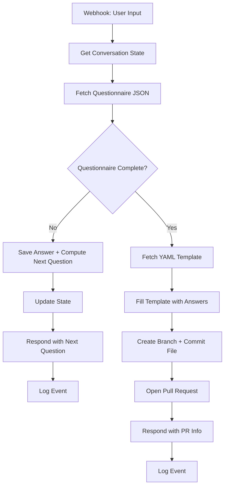
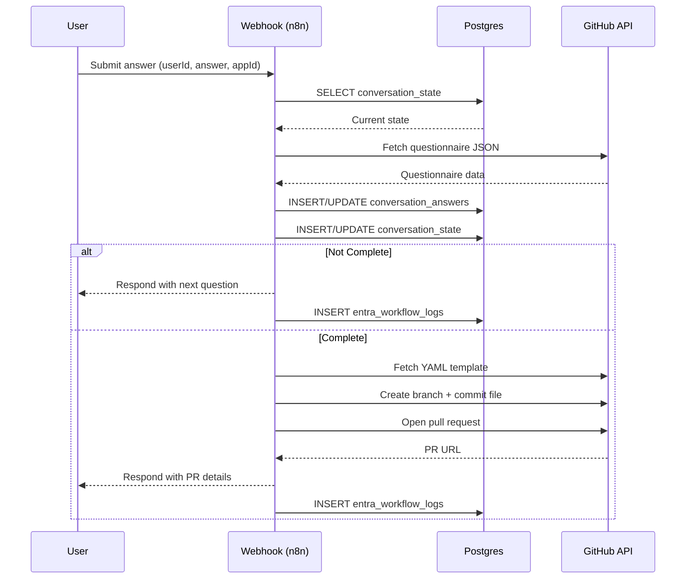

~~~markdown
# Entra Onboarding Chat Workflow

This workflow automates **interactive onboarding for Entra ID applications**, guiding users through a questionnaire and generating GitHub pull requests with onboarding configuration files.

---

## 🚀 Features
- Webhook entry point (`/entra-onboarding-chat`) for chat-style onboarding.
- Conversational state stored in **Postgres** (`conversation_state`, `conversation_answers`).
- Dynamic question flow driven by external questionnaire JSON.
- YAML onboarding template populated with user-provided answers.
- GitHub integration to create branches, commit config files, and open PRs.
- Structured logging into **Postgres** (`entra_workflow_logs`).
- Unified JSON responses with `status`, `correlationId`, and `data`.

---

## 🛠️ Requirements
- **n8n**: Version per `runtime-target.json` (not `:latest`).
- **Database**: PostgreSQL with the following tables:
  - `conversation_state`
  - `conversation_answers`
  - `entra_workflow_logs`
- **Credentials**:
  - `CRED.postgres` → PostgreSQL database
  - `CRED.github` → GitHub API token with `repo` scope

---

## 📂 Database Schema
- **conversation_state**
  - `user_id` (text, PK)
  - `current_question` (text)
  - `app_id` (text, nullable)
  - `last_updated` (timestamptz)

- **conversation_answers**
  - `user_id` (text)
  - `question_id` (text)
  - `answer` (text)
  - `timestamp` (timestamptz)

- **entra_workflow_logs** (extended for logging standard)
  - `event` (text)
  - `workflow` (text)
  - `node` (text)
  - `correlationId` (text)
  - `status` (text)
  - `error` (text)
  - `level` (text)
  - `timestamp` (timestamptz, default `now()`)
  - `workflowVersion` (text, default `1.0.0`)

---

## 🔄 Flow Overview
1. **Webhook** receives user input (`userId`, `answer`, `app_id`).
2. **Conversation state** is fetched or initialized.
3. **Questionnaire JSON** is pulled from GitHub.
4. Workflow determines **next question** or marks completion.
5. **Answers are stored** in Postgres.
6. If complete:
   - YAML template is fetched.
   - Placeholders are replaced with collected answers.
   - File is committed to GitHub in a new branch.
   - Pull Request is opened.
7. **Structured logs** are written to `entra_workflow_logs`.
8. Workflow responds with unified JSON.

### 📊 Flow Diagram


### 🔄 Sequence Diagram


---

## 📤 Response Format
```json
{
  "status": "in_progress" | "completed" | "error",
  "correlationId": "<uuid>",
  "data": { ... }
}
```

---

## 📊 Logging Standard
Each event logged includes:
- `event`, `workflow`, `node`
- `correlationId`
- `status`, `error`
- `level` (INFO, WARN, ERROR)
- `timestamp`
- `workflowVersion`

---

## 📝 Metadata
- **Workflow Name**: Entra Onboarding Chat Manual
- **Version**: 1.0.0
- **Tags**: `semver:1.0.0`, `onboarding`, `entra`
- **Author**: GoyaAcademy Automation Team
- **Created**: 2025-09-18

---

## ⚠️ Notes
- Ensure DB migration is applied (adds `timestamp` + `workflowVersion` to `entra_workflow_logs`).
- Disabled test/debug nodes from earlier drafts have been removed in this cleaned version.
- GitHub repo config (`owner`, `repo`, `base`) should be set via environment variables in production.
~~~

