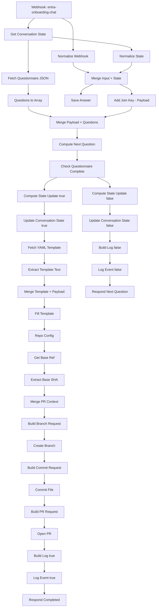
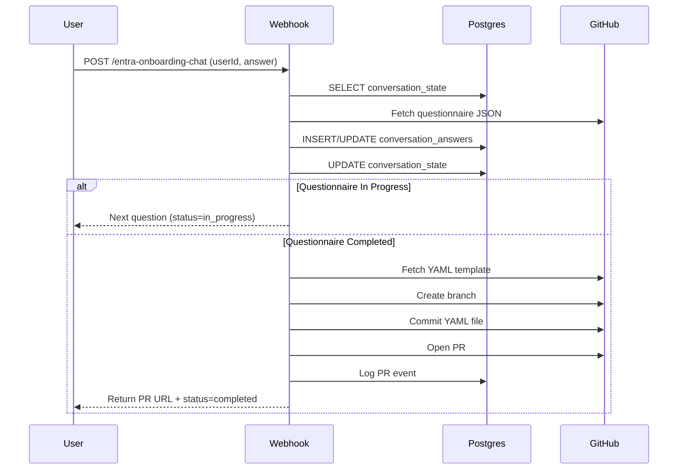

# Entra Onboarding Chat Workflow

## Overview
This workflow automates an **interactive chat-driven onboarding process** for Microsoft Entra ID applications.  
It guides users through a structured questionnaire, stores responses in a PostgreSQL database, and, upon completion, generates a YAML configuration file.  
That file is then committed to GitHub in a new branch and submitted as a Pull Request (PR) for review.

The flow ensures:
- Persistent conversation state tracking per user
- Dynamic retrieval of questionnaires from GitHub
- Storage of answers and validation
- Automated YAML template filling
- GitHub integration for commit and PR creation
- Structured logging of all key events

---

## Requirements

### Database Tables
This workflow depends on **PostgreSQL**.  
You need the following tables:

```sql
-- Stores progress of each user’s questionnaire
CREATE TABLE conversation_state (
  user_id TEXT PRIMARY KEY,
  current_question TEXT NOT NULL,
  app_id TEXT,
  last_updated TIMESTAMP DEFAULT now()
);

-- Stores answers to questions
CREATE TABLE conversation_answers (
  user_id TEXT NOT NULL,
  question_id TEXT NOT NULL,
  answer TEXT,
  timestamp TIMESTAMP DEFAULT now(),
  PRIMARY KEY (user_id, question_id)
);

-- Stores workflow event logs
CREATE TABLE entra_workflow_logs (
  event TEXT,
  workflow TEXT,
  node TEXT,
  correlationid TEXT,
  status TEXT,
  error TEXT,
  level TEXT,
  created_at TIMESTAMP DEFAULT now()
);
```

### Credentials
- **Postgres** credentials (`CRED.postgres`)
- **GitHub API** credentials (`CRED.github`)

---

## Flow Diagram



---

## Sequence Diagram



---

## Key Features
- **Conversation State Tracking:** Maintains continuity across multiple user requests.  
- **Dynamic Questionnaires:** Retrieves the latest version from GitHub.  
- **GitHub Automation:** Generates YAML files, commits, and opens PRs seamlessly.  
- **Structured Logging:** All workflow events recorded for traceability.  
- **Idempotent Design:** Handles repeated inputs gracefully without duplication.

---

## How to Use
1. Deploy workflow to your **n8n** instance.  
2. Ensure Postgres tables exist.  
3. Configure required credentials:
   - GitHub API (PAT or App)
   - Postgres database
4. Send a POST request to:
   ```
   http://<n8n-server>/webhook/entra-onboarding-chat
   ```
   with JSON body:
   ```json
   {
     "userId": "dev-001",
     "answer": "sample answer"
   }
   ```
5. Continue answering until PR is generated.

---

## Output
- If in progress:
  ```json
  {
    "status": "in_progress",
    "questionId": "q2",
    "question": "Does your app use SSO?",
    "options": ["Yes", "No"]
  }
  ```

- If completed:
  ```json
  {
    "status": "completed",
    "prUrl": "https://github.com/org/repo/pull/123",
    "branch": "onboard/dev-001-20250918-203000",
    "path": "onboarding/dev-001-20250918-203000.yaml"
  }
  ```
